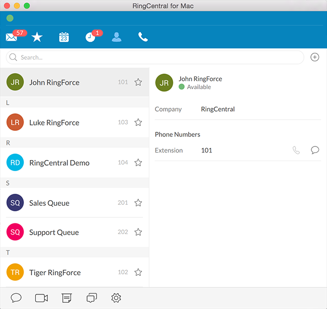

RingCentral Avatars
===================

[![Gem Version][gem-version-svg]][gem-version-link]
[![Build Status][build-status-svg]][build-status-link]
[![Dependency Status][dependency-status-svg]][dependency-status-link]
[![Code Climate][codeclimate-status-svg]][codeclimate-status-link]
[![Scrutinizer Code Quality][scrutinizer-status-svg]][scrutinizer-status-link]
[![Downloads][downloads-svg]][downloads-link]
[![Docs][docs-rubydoc-svg]][docs-rubydoc-link]
[![License][license-svg]][license-link]

## Overview

This library will build RingCentral avatars using Gmail-like initial avatars. It can build Gmail-like avatars for the following:

* all RingCentral users (extensions) without images
* all RingCentral users, overwriting existing images (useful for testing in Sandbox accounts)
* specific extensions
* authorized user extension only

By default, the images will look like the following in the RingCentral softphone:



This library uses [Avatarly](https://github.com/lucek/avatarly) to generate the avatars and can pass through any avatar option for customization purposes.

## Pre-requisites

* ImageMagick
* A RingCentral account (production or sandbox)
* A RingCentral administrator account is necessary to update profile images for others

Test first in sandbox. Your app needs to be graduated in order to run against your production account.

## Installation

```bash
$ gem install ringcentral-avatars
```

## Usage

```ruby
require 'ringcentral-avatars'
require 'ringcentral_sdk'

client = RingCentralSdk.new [...]

avatars = RingCentral::Avatars.new client                                # Default options
avatars = RingCentral::Avatars.new client, avatar_opts: {font_size: 250} # Avatarly options

avatars.create_defaults             # create default avatars only
avatars.create_all                  # create all avatars, overwriting existing avatars

avatars.create_mine                 # does not overwrite existing user avatar
avatars.create_mine overwrite: true # overwrite existing user avatar
```

See [Avatarly](https://github.com/lucek/avatarly) for avatar customization options. The default avatar size is `600`.

### Change Log

See [CHANGELOG.md](CHANGELOG.md)

## Links

Project Repo

* https://github.com/ringcentral-ruby/ringcentral-avatars-ruby

RingCentral Ruby SDK

* https://github.com/ringcentral-ruby/ringcentral-sdk-ruby

RingCentral API Explorer

* https://developer.ringcentral.com/api-explorer/latest/index.html

## Contributing

1. Fork it ( http://github.com/ringcentral-ruby/ringcentral-avatars-ruby/fork )
2. Create your feature branch (`git checkout -b my-new-feature`)
3. Commit your changes (`git commit -am 'Add some feature'`)
4. Push to the branch (`git push origin my-new-feature`)
5. Create new Pull Request

## License

RingCentral Avatars is available under an MIT-style license. See [LICENSE.txt](LICENSE.txt) for details.

RingCentral Avatars &copy; 2016 by John Wang

 [gem-version-svg]: https://badge.fury.io/rb/ringcentral-avatars.svg
 [gem-version-link]: http://badge.fury.io/rb/ringcentral-avatars
 [downloads-svg]: http://ruby-gem-downloads-badge.herokuapp.com/ringcentral-avatars
 [downloads-link]: https://rubygems.org/gems/ringcentral-avatars
 [build-status-svg]: https://api.travis-ci.org/ringcentral-ruby/ringcentral-avatars-ruby.svg?branch=master
 [build-status-link]: https://travis-ci.org/ringcentral-ruby/ringcentral-avatars-ruby
 [coverage-status-svg]: https://coveralls.io/repos/ringcentral-ruby/ringcentral-avatars-ruby/badge.svg?branch=master
 [coverage-status-link]: https://coveralls.io/r/ringcentral-ruby/ringcentral-avatars-ruby?branch=master
 [dependency-status-svg]: https://gemnasium.com/ringcentral-ruby/ringcentral-avatars-ruby.svg
 [dependency-status-link]: https://gemnasium.com/ringcentral-ruby/ringcentral-avatars-ruby
 [codeclimate-status-svg]: https://codeclimate.com/github/ringcentral-ruby/ringcentral-avatars-ruby/badges/gpa.svg
 [codeclimate-status-link]: https://codeclimate.com/github/ringcentral-ruby/ringcentral-avatars-ruby
 [scrutinizer-status-svg]: https://scrutinizer-ci.com/g/ringcentral-ruby/ringcentral-avatars-ruby/badges/quality-score.png?b=master
 [scrutinizer-status-link]: https://scrutinizer-ci.com/g/ringcentral-ruby/ringcentral-avatars-ruby/?branch=master
 [docs-rubydoc-svg]: https://img.shields.io/badge/docs-rubydoc-blue.svg
 [docs-rubydoc-link]: http://www.rubydoc.info/gems/ringcentral-avatars/
 [license-svg]: https://img.shields.io/badge/license-MIT-blue.svg
 [license-link]: https://github.com/ringcentral-ruby/ringcentral-avatars-ruby/blob/master/LICENSE.md
