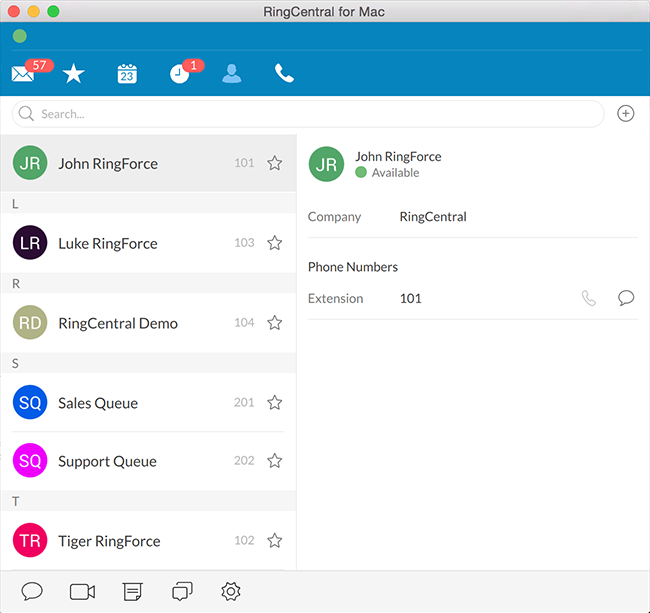

### Updating the RingCentral Address Book with Default Avatars

RingCentral API Tutorial using Ruby

https://github.com/grokify/ringcentral-avatars-ruby

By John Wang

---

## Overview

* Differentiated default avatars are a better UX
* RingCentral does not offer this out of the box
* It is easily achieved using the RingCentral API

---

## The Goal



---

## Pre-Requisites

Community RingCentral SDK

Code: https://github.com/grokify/ringcentral-sdk-ruby

Docs: https://ringcentral-sdk-ruby.rtfd.org

---

## Basic Steps

1. Retrieve a list of users without avatars
1. For each user, create and upload avatar
1. Handle rate limiting

---

### Retrieving Users Without Images

```ruby
require 'ringcentral_sdk'
client = RingCentralSdk::REST::Client.new do |config|
  # your config params
end

res = client.get 'account/~/extension'
res.body['records'].each do |ext|
  # skip if user has an existing image
  next if ext['profileImage'].key?('etag')
  # create image and upload image
end
```

Implementation: [ringcentral-avatars-ruby/lib/ringcentral-avatars/creator.rb](https://github.com/grokify/ringcentral-avatars-ruby/blob/master/lib/ringcentral-avatars/creator.rb)

---

### Extension ProfileImage property

```ruby
  "profileImage": {
    "uri": "https://media.devtest.ringcentral.com/restapi/v1.0/account/11111111/extension/22222222/profile-image",
    "etag": "0123456789abcdef0123456789abcdef",
    "contentType": "image/png",
    "lastModified": "2016-11-01T00:00:00.000Z",
    "scales": [
      {
        "uri": "https://media.devtest.ringcentral.com/restapi/v1.0/account/11111111/extension/22222222/profile-image/90x90"
      },
      {
        "uri": "https://media.devtest.ringcentral.com/restapi/v1.0/account/11111111/extension/22222222/profile-image/195x195"
      },
      {
        "uri": "https://media.devtest.ringcentral.com/restapi/v1.0/account/11111111/extension/22222222/profile-image/584x584"
      }
    ]
  }
```

---

### Handling Paging

The paging and navigation properties

```json
{
  "paging" : {
    "page" : 1,
    "totalPages" : 2,
    "perPage" : 100,
    "totalElements" : 150,
    "pageStart" : 0,
    "pageEnd" : 99
  },
  "navigation" : {
    "firstPage" : {
      "uri" : "https.../restapi/v1.0/account/11111111/extension?page=1&perPage=1"
    },
    "nextPage" : {
      "uri" : "https.../restapi/v1.0/account/11111111/extension?page=1&perPage=2"
    },
    "lastPage" : {
      "uri" : "https.../restapi/v1.0/account/11111111/extension?page=1&perPage=2"
    }
  }
}
```

---

### Retrieving Multiple Pages of Users

```ruby
res = @client.http.get 'account/~/extension'
# handle results

if retrieve_all
  while res.body.key?('navigation') && res.body['navigation'].key?('nextPage')
    res = @client.http.get do |req|
      req.url res.body['navigation']['nextPage']['uri']
    end
    # handle results
  end
end
```

Implementation: [ringcentral_sdk/rest/cache/extensions.rb](https://github.com/grokify/ringcentral-sdk-ruby/blob/master/lib/ringcentral_sdk/rest/cache/extensions.rb)

---

### Creating the Avatar

Creating initials with avatarly

```ruby
require 'avatarly'
blob = Avatarly.generate_avatar 'AZ'
```

Creating identicons with ruby_identicon

```ruby
require 'ruby_identicon'
blob = RubyIdenticon.create 'AZ'
```

Implementation: [ringcentral-avatars-ruby/lib/ringcentral-avatars/creator.rb](https://github.com/grokify/ringcentral-avatars-ruby/blob/master/lib/ringcentral-avatars/creator.rb)

---

### Uploading the Image

Converting blob to a `Faraday::UploadIO` object

```ruby
file = Tempfile.new ['avatar', 'png']
file.binmode
file.write blob
file.flush
faradayio = Faraday::UploadIO.new file.path, 'image/png'
```

Uploading the image

```ruby
client.http.put "account/~/extension/#{extensionId}/profile-image", image: faradayio
```

Implementation: [ringcentral-avatars-ruby/lib/ringcentral-avatars/creator.rb](https://github.com/grokify/ringcentral-avatars-ruby/blob/master/lib/ringcentral-avatars/creator.rb)

---

### Handling Rate Limit Throttling

* RingCentral APIs are rate limited
* API calls exceeding that rate are throttled with a 429 error and Retry-After header

```ruby
if res.status == 429
  sleep res.headers['Retry-After']
  # re-execute API call
end
```

---

### Automatic Retry Handling

Built into SDK

```ruby
require 'ringcentral_sdk'

client = RingCentralSdk::REST::Client.new do |config|
  # your config params
  config.retry = true # retry throttled API calls
end
```

Implementation: [faraday_middleware-request-retry/lib/faraday_middleware-request-retry/retry.rb](https://github.com/grokify/faraday_middleware-request-retry/blob/master/lib/faraday_middleware-request-retry/retry.rb)

---

### Putting It Together

Using the pre-built ringcentral-avatars gem

```ruby
require 'ringcentral-avatars'
require 'ringcentral_sdk'

client = RingCentralSdk::REST::Client.new do |config|
  # your config params
  config.retry = true
end

avatars = RingCentral::Avatars.new client
avatars.create_defaults
```

Implementation: [ringcentral-avatars-ruby/scripts/update_avatar.rb](https://github.com/grokify/ringcentral-avatars-ruby/blob/master/scripts/update_avatar.rb)

---

# Demo

1. Login to RC Softphone and open address book
1. Configure `.env` file used by [`update_avatar.rb`](https://github.com/grokify/ringcentral-avatars-ruby/blob/master/scripts/update_avatar.rb)
1. Run [`update_avatar.rb`](https://github.com/grokify/ringcentral-avatars-ruby/blob/master/scripts/update_avatar.rb)

Watch at https://youtu.be/8jCwxfWl_a4

---

### About this Presentation

* Made Using Reveal-md: https://github.com/webpro/reveal-md
* Hosted at: https://grokify.github.io/ringcentral-avatars-ruby/tutorial/presentation

---

### Thanks!

* Code: [github.com/grokify/ringcentral-avatars-ruby](https://github.com/grokify/ringcentral-avatars-ruby)
* SDK: [github.com/grokify/ringcentral-sdk-ruby](https://github.com/grokify/ringcentral-sdk-ruby)
* Dev Portal: [developer.ringcentral.com](https://developer.ringcentral.com)
* Dev Community: [devcommunity.ringcentral.com](https://devcommunity.ringcentral.com/)
* Stack Overflow: [stackoverflow.com/questions/tagged/ringcentral](https://stackoverflow.com/questions/tagged/ringcentral)
* Github / Twitter / Medium: @grokify